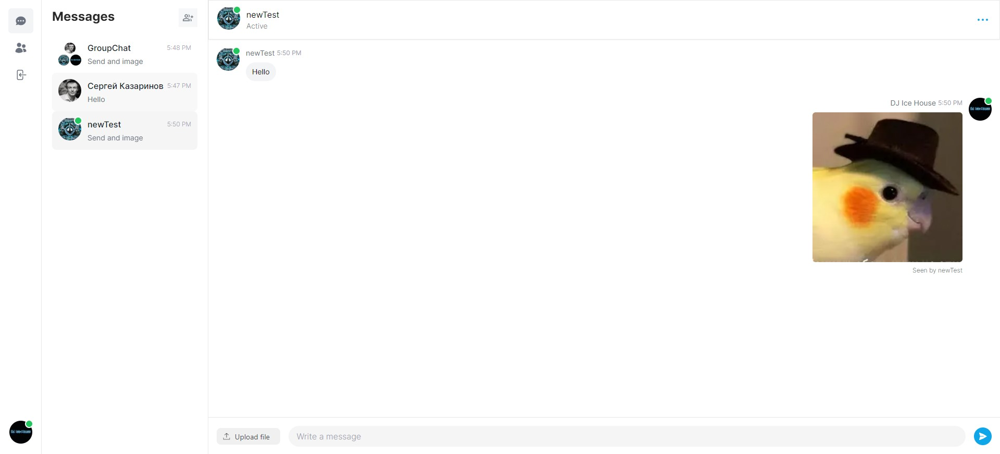

# Проект: Messenger



## Описание:

Аналог приложения Messenger для обмена сообщениями в режиме реального времени.

### Возможности приложения:
- Авторизация пользователя через Google или GitHub
- Обмен сообщениями в режиме реального времени
- возможность отправки изображений
- Статус о прочтении сообщения
- Статус активности пользователя (Online/Offline)
- Создание групповых чатов
- Настройка профиля


### Используемые технологии:

- Адаптивная верстка для всех устройств
- Для стилизации элементов страницы используется [TailwindCSS](https://tailwindcss.com/)
- Авторизация пользователя реализована с помощью [NextAuth](https://next-auth.js.org/)
- Загрузка файлов и изображений реализована при помощи [Uploadcare](https://uploadcare.com/)
- Для обмена сообщениями в режиме реального времени используется [Pusher](https://pusher.com/)
- Работа с формами реализована при помощи [React-hook-form](https://react-hook-form.com/)
- Обработка ошибок сервера реализована при помощи [React-hot-toast](https://react-hot-toast.com/)
- Для работы с базой данных используется [Prisma](https://www.prisma.io/)
- Для Code Style используется [ESLint](https://eslint.org/) совместно с [Airbnb](https://airbnb.io/javascript/react/)


[Ссылка на сайт](https://messenger-mu-black.vercel.app/)


## Stacks:
- TypeScript
- Next.js 13
- Prisma
- MongoDB
- Tailwind CSS
- Eslint
- Node v18.x

## Быстрый старт

<br />

1. Склонировать проект на свой компьютер

```bash
git clone https://github.com/SergeyKazarinov/messenger.git
```

2. Перейти в папку с проектом и установить зависимости в проекте

```bash
npm install
```

3. Чтобы запустить проект, необходимо добавить следующие переменные среды в файл .env

```javaScript
DATABASE_URL=
NEXTAUTH_SECRET=
GITHUB_ID=
GITHUB_SECRET=

GOOGLE_CLIENT_ID=
GOOGLE_CLIENT_SECRET=

NEXT_PUBLIC_PUSHER_APP_KEY=
PUSHER_APP_ID=
PUSHER_SECRET=
```

4. Установить Prisma
```bash
npx prisma db push
```

5. Запустить проект

```bash
npm run dev
```

